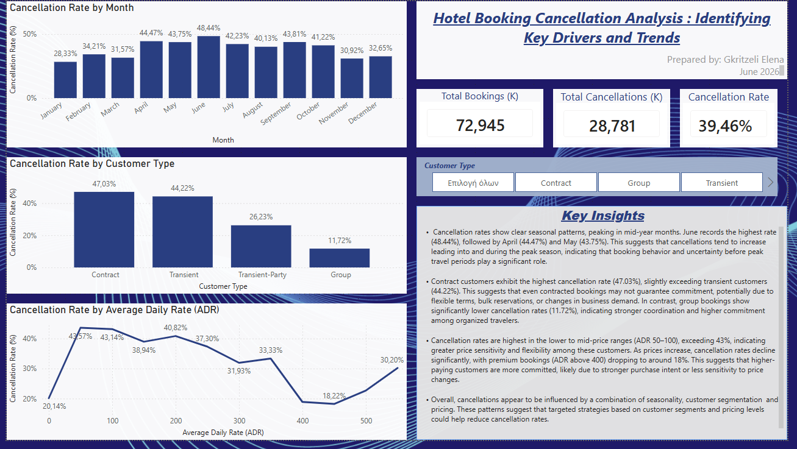

# 🏨 Hotel Booking Cancellation Analysis

## 📊 Overview
This project analyzes hotel booking cancellations using Power BI to identify key patterns and drivers behind customer behavior. 

The analysis focuses on three main dimensions: seasonality, customer segmentation, and pricing, providing actionable insights to improve booking stability and reduce cancellations.

---

## 🎯 Project Objective
The main goal of this project is to answer the business question:

👉 Why do customers cancel hotel bookings?

Specifically:
- When do cancellations occur?
- Which customer types are more likely to cancel?
- How does pricing influence cancellation behavior?

---

## 🧹 Data Cleaning
Initial data exploration revealed invalid and extreme values in the ADR (Average Daily Rate) variable.

The following steps were applied:
- Removed negative ADR values  
- Filtered extreme outliers (ADR > 600)  

These steps ensured realistic data and improved the accuracy of the analysis.

---

## 📈 Key KPIs
The following metrics were created:

- **Total Bookings (K)**  
- **Total Cancellations (K)**  
- **Cancellation Rate (%)**  

K-values were used (thousands) to improve readability of large numbers.

---

## 📊 Analysis & Findings

### 🔹 Seasonality
- Cancellation rates peak in mid-year months  
- June shows the highest rate (~48%)  
- Lower rates are observed in early and late months  

👉 This suggests increased uncertainty leading into and during peak travel periods.

---

### 🔹 Customer Segmentation
- Contract customers have the highest cancellation rate (~47%)  
- Transient customers follow closely (~44%)  
- Group bookings show significantly lower rates (~12%)  

👉 This indicates differences in commitment levels across customer segments.

---

### 🔹 Pricing (ADR)
- Highest cancellations occur in lower to mid-price ranges (ADR 50–100)  
- Cancellation rates decrease as prices increase  
- Premium bookings show the lowest cancellation behavior  

👉 This suggests that higher-paying customers are more committed.

---

## 🧠 Key Business Insight
Cancellations are driven by a combination of:

- Seasonality (timing)  
- Customer behavior (segment)  
- Price sensitivity  

👉 These insights can support targeted strategies to reduce cancellations.

---

## 🎛 Dashboard Features
- Interactive slicer (Customer Type)  
- KPI indicators for quick overview  
- Time-based, customer-based, and price-based analysis  
- Clean single-page dashboard layout  

---

## 🛠 Tools & Technologies
- Power BI  
- Basic DAX  
    

---

## 📂 Dataset
The dataset used in this project is the **Hotel Booking Demand Dataset**.

- Source: Kaggle  
- Authors: Antonio, Almeida & Nunes (2019)  
- Link: https://www.kaggle.com/datasets/jessemostipak/hotel-booking-demand
  
The dataset was made available on Kaggle by user "jessemostipak" and is publicly available for educational and analytical purposes.

---

## 📸 Dashboard Preview

---

## 📁 Files Included
- `hotel_bookings.csv` → dataset  
- `hotel_cancellation_dashboard.pbix` → Power BI dashboard  
- `Project Summary.docx` → documentation  

---

## ✅ Conclusion
This project demonstrates how data analysis and visualization can uncover patterns in customer behavior. 

The findings highlight key drivers of cancellations and provide a structured approach to improving decision-making in the hospitality sector.

---

## 👤 Author
Gkritzeli Elena
